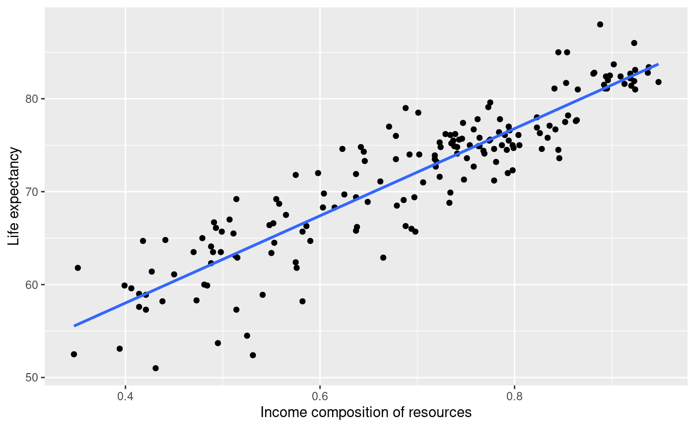
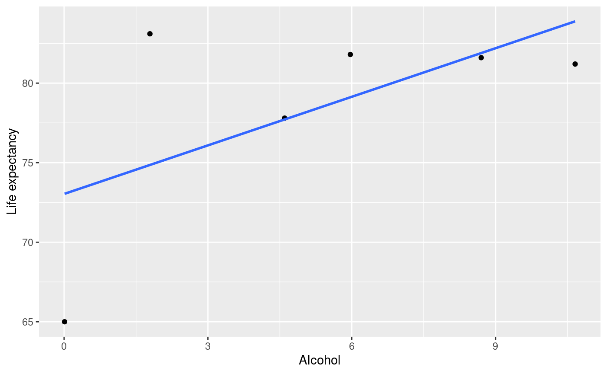
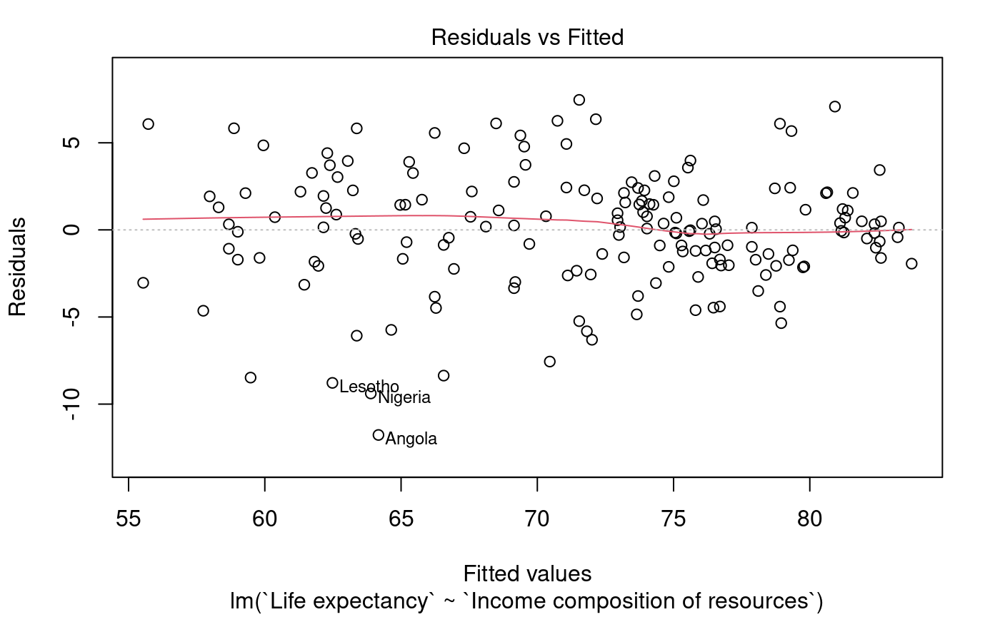
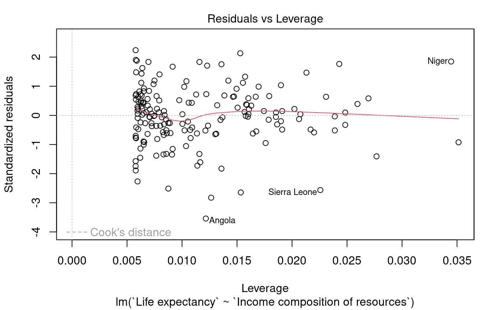
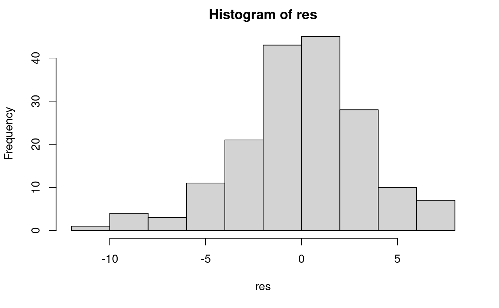
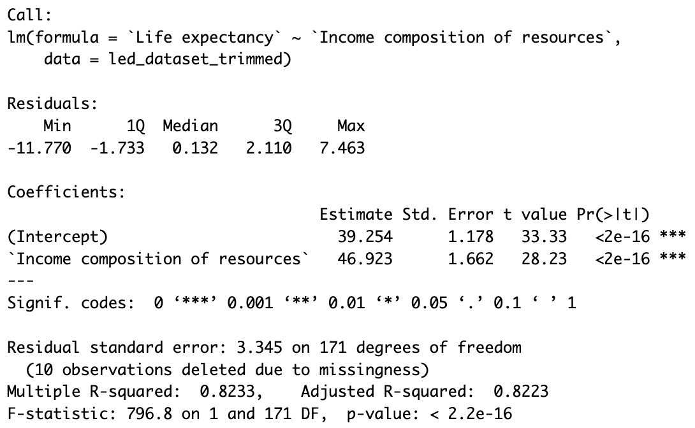

# Life-Expectancy-Regression-Model
Linear Regression Model predicting Life Expectancy using R

#### Research Question

What are the factors that may have a relationship with life expectancy on a global scale?

1. **Income composition of resources**: Human Development Index (range from 0 to 1) in terms of income composition of resources. This is a good social measure for a country's development.
2. **Alcohol consumption**: Is this a negatively related, or positively related factor to life expectancy?

I am interested in finding if there is a linear relationship between each of these factors and life expectancy. With that, I will use **linear regression** to test my hypotheses.

#### Data collection

- Dataset synthesized from data published by the **World Health Organization** of 193 countries from 2000 to 2015.
- For dependency considerations, I have narrowed the dataset down into countries in 2015 only. This gives me a dataset with **183 countries/cases** (with 10 missing cases due to challenges of collecting data in these nations) and **3 variables**

  * ```Life expectancy``` (in age): numerical variable — life expectancy in age
  * ```Income composition of resources``` (index ranging from 0 to 1): numerical variable
  * ```Alcohol consumption``` (in liters of pure alcohol): numerical variable - recorded consumption of pure alcohol per capita (> 15 years of age)

#### Descriptives

Just by looking at the scatterplot of ```Life expectancy``` vs. ```Income composition of resources```, I can see that there is a positive, linear relationship. In the case of ```Alcohol consumption```, there is also a "positive, linear" relationship. But there is an **extreme lack of data** (177 rows missing), so it is not reasonable to build a model off from these 6 points.





Since there is possibility of doing a model on ```Life expectancy``` and ```Income composition of resources```, let's check the conditions and assumptions for doing linear regression on these 2 variables:

#### Conditions and Assumptions

1. Linearity: pass. No particular bends in the residuals plot either.
2. Independence: need further consideration. With the available tools in hand, I cannot quantify the correlation between countries, whether it is in terms of economic or geographic ties.
3. Equal variability of residuals: can pass. The vertical width of the scatter does not seem to change radically from left to right.



4. Outliers: can pass. There are 3 outliers, as shown by R output. The ```Niger``` data point has high leverage, but its associated residual is not too weird compared with other data points. The other 2, ```Sierra Leone``` and ```Angola``` does not have much leverage, so not influential on the slope of the fitted line.



5. Normal distribution of residuals: pass. There is a slight left skew, but not too extreme.



#### Inference and Confidence Interval

The output given by the model is as follows:



From this output, we can derive a few things:

- The slope of the fitted line is approximately 46, so we can say that given 2 countries that differ 0.1 in income index, their life expectancy values are expected to differ by 4.6 in age.
- The R^2 of the model is approximately 82.33%, so about 82.33% of the variation in life expectancy is accounted for using the model. This is a pretty good model.

Finally, hypothesis testing results:

- With the p-value of < 2.2.10^-16, which is pretty small, we can **reject the null hypothesis that claims the slope is 0**. This means the data shows evidence of a relationship between life expectancy and income index. In this case, there is a positive relationship.
- This result also agrees with the 95% confidence interval for the slope: For 2 given countries with a difference of 0.1 in income index, we are 95% confident that their associated life expectancy values will differ by 4.3 to 5 years.

#### Limitations and Next steps

- Some further tools might be needed to quantify the dependency between countries. Since this model has not accounted for such relationships, there are some limits to the results of this model.
  
- Continuing with finding the relationship between alcohol consumption and life expectancy, I can see that there is actually not a **strong linear relationship** between these 2 variables. It might be that linear regression is not the appropriate tool to find their relationship.
  * Regardless, I still need to merge the available data from WHO to account for the missing data on alcohol consumption
  * Then, I can use the Analysis of Variance test by dividing countries into different groups of life expectancy (< 50, between 50 and 70, > 70) and compare their means of alcohol consumption.

- Possibilities for new multiple regression models:
  * May want to find out what combinations of variables best predict life expectancy
  * But of course, I need to carefully consider multicollinearity between these variables, and compare their adjusted R^2 to see which one is most effective.

#### Contact

Linh Do (dohalinh2303@gmail.com)
